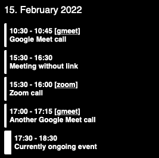
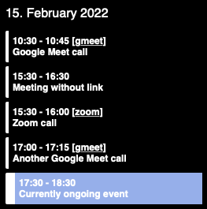

# Calendar widget for Übersicht

This [Übersicht](http://tracesof.net/uebersicht/) widget displays calendar events.

If an event has a Zoom link and/or Google Meet link attached to it, a link will be shown to join the respective call.

A currently ongoing event will be highlighted with a thicker bar on the left side.

It requires a dark background or modifications to the colors to be properly readable.

Inspiration and some code was taken from [`knazarov/ubersicht-calendar-widget`](https://github.com/knazarov/ubersicht-calendar-widget).

## How to install

- Place the [`calendar.coffee`](calendar.coffee) file in the Übersicht widgets directory.
- Open the `calendar.coffee` file and adjust values in the "CUSTOMIZE ME" section to adjust widget placement and size.
