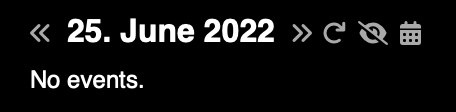

# Calendar widget for Übersicht

This [Übersicht](http://tracesof.net/uebersicht/) widget displays calendar events.

If an event has a Zoom, Google Meet and/or Teams link attached to it (as location or in notes), a link will be shown to join the respective call.

A currently ongoing event will be highlighted with red text and with a thicker bar on the left side.
Events that start within the next 30 minutes will be highlighted with red text only.
Past events use grey text.

The buttons next to the date allow you to navigate between days, jump back to today, hide all events (for privacy) and open the Calendar desktop application (or a replacement if desired).

It requires a dark background or modifications to the colors to be properly readable.

Inspiration and some code was taken from [`knazarov/ubersicht-calendar-widget`](https://github.com/knazarov/ubersicht-calendar-widget).

## How to install

- Download the `.zip` archive and place the content (a directory called `yet-another-simple-calendar.widget`) in the Übersicht widgets directory.
- Open the `calendar.jsx` file and adjust values in the "CUSTOMIZE ME" section to adjust widget placement and size.

## Ideas for enhancements

- Fetch multiple days in background to speed up.
- Have reproducible way to generate screenshots.
- Add background color and opacity to customizable variables.

## Acknowledgements

- Icons from [fontawesome.com](https://fontawesome.com/)
