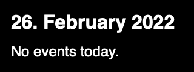

# Calendar widget for Übersicht

This [Übersicht](http://tracesof.net/uebersicht/) widget displays calendar events.

If an event has a Zoom, Google Meet and/or Teams link attached to it (as location or in notes), a link will be shown to join the respective call.

A currently ongoing event will be highlighted with red text and with a thicker bar on the left side.
Events that start within the next 30 minutes will be highlighted with red text only.
Past events use grey text.

It requires a dark background or modifications to the colors to be properly readable.

Inspiration and some code was taken from [`knazarov/ubersicht-calendar-widget`](https://github.com/knazarov/ubersicht-calendar-widget).

## How to install

- Create a new directory in the Übersicht widgets directory, e.g. `calendar`, and place the [`calendar.jsx`](calendar.jsx) file in it.
- Open the `calendar.jsx` file and adjust values in the "CUSTOMIZE ME" section to adjust widget placement and size.

## Ideas for enhancements

- Buttons to switch date (at least +/- 1 day)
